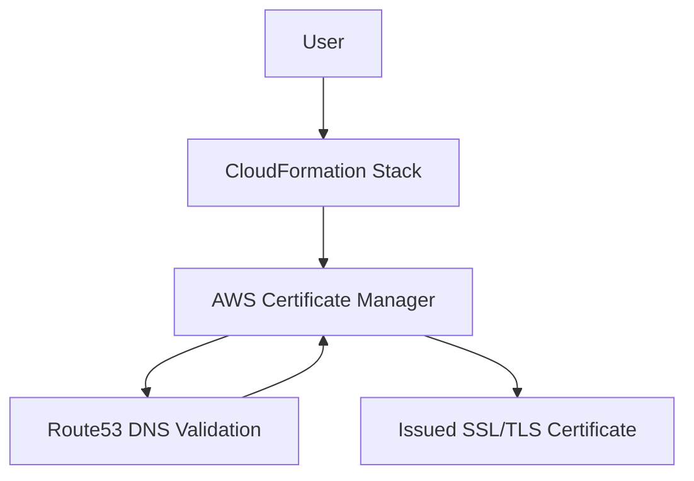

# AWS CloudFormation: Automate SSL/TLS Certificate Creation with ACM

[](https://github.com/cbschuld/aws-cf-create-certificate/stargazers)
[](LICENSE)

This repository provides a CloudFormation template to automate SSL/TLS certificate creation using AWS Certificate Manager (ACM) for secure static websites with S3, CloudFront, and Route53.

Allows you to provision both the apex (e.g. domain.com) and wildcard (e.g. \*.domain.com) ACM certificates via CloudFormation, automatically creating DNS validation records and exporting the certificate ARN for use in other scripts or templates.

## Quick Use

Determine the `HostedZoneId` for your domain:
```sh
 ./get-hosted-zone-id.sh -d [DOMAIN] -p [NAMED_PROFILE]
```

Deploy to create the Certificate:
__Note: The `AppName` is used to prefix the output from the certificate.__
```sh
./deploy.sh \
    -d imgbt.com \
    -z [ZONE_ID] \
    -a [APP_NAME] \
    -p [NAMED_PROFILE] \
    -r [REGION]
```

## Architecture


## Summary of Scripts

A small collection of Bash utilities to streamline ACM certificate provisioning:

- **get-hosted-zone-id.sh**  
  Lookup the Route 53 Hosted Zone ID for a given domain and AWS CLI profile.

- **deploy-certificate.sh**  
  Deploy a DNS‑validated ACM certificate (apex + wildcard) using CloudFormation, tagging resources by application name.

Both scripts verify prerequisites (AWS CLI) and validate all required parameters before executing. Simply pass in your domain, hosted zone, application name and AWS profile to automate certificate issuance end‑to‑end.

## Use Cases
- Produce apex and wildcard certificates with an output Arn
- Automating certificate provisioning for CI/CD pipelines.
- Securing a static website with HTTPS.
- Learning CloudFormation and ACM for AWS certifications.

## Contributing
Want to improve this template? Submit a pull request or open an issue! We're looking for:
- New features (e.g., ACM certificate automation).
- Documentation enhancements.
- Architecture diagrams or example sites.

## License
This project is licensed under the MIT License. See the [LICENSE](LICENSE.md) file for details.

## Stay Updated
Star this repo and follow me on [X](https://x.com/cbschuld) for updates!
